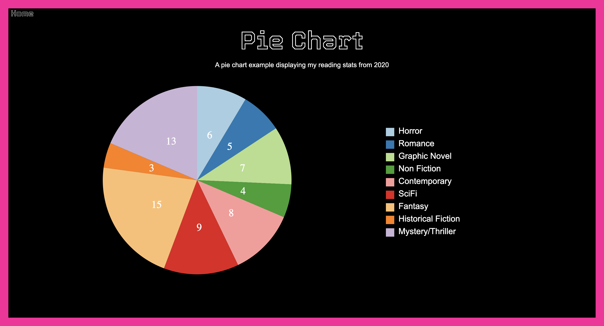

# d3.js Sample Site

## Project Description

This website displays some of my skills working with D3.js. To make it fun and personal I've used the charts to display information about books that I've read over the years.

The Samples Included:

- Pie Chart
- Group Bar Graph
- Collapsible Tree
- Icicle Graph

## Examples

### Pie Chart

### Group Bar Graph

### Collapsible Tree

### Icicle Graph